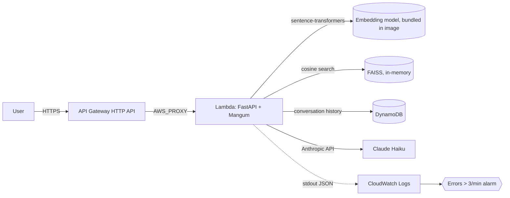

# Cloud RAG Engine

Production RAG service: FastAPI + Docker + AWS Lambda + Terraform + FAISS + DynamoDB + RAGAS eval.

> **Demo (90s):** `https://www.loom.com/share/ca1579ec76134c96b6ca0dc7dfc57a7b`
> **Live API:** `https://2oc1tgm493.execute-api.us-east-1.amazonaws.com/query`

## What this project demonstrates
- Designed and deployed a serverless RAG service on AWS Lambda with infrastructure as code (Terraform).
- Multi-turn conversation support via DynamoDB; agentic-coding workflow documented in AGENT_LOG.md.
- Measured retrieval quality with RAGAS: [your real numbers here].
- Structured JSON logging + CloudWatch alarming for production observability.
- Secure CI/CD via GitHub OIDC — zero long-lived AWS credentials.
- Framed around a KYC/AML adverse-media use case.

## Evaluation Results

| Metric            | Score | Notes                                              |
|-------------------|-------|----------------------------------------------------|
| Faithfulness      | 1.00  | RAGAS: answer is grounded in retrieved chunks      |
| Context precision | 0.87  | Avg fraction of retrieved chunks that are relevant |

## Architecture

## Evaluation, Deployment, Agentic Log → see /eval, /infra, AGENT_LOG.md, docs/stories.md